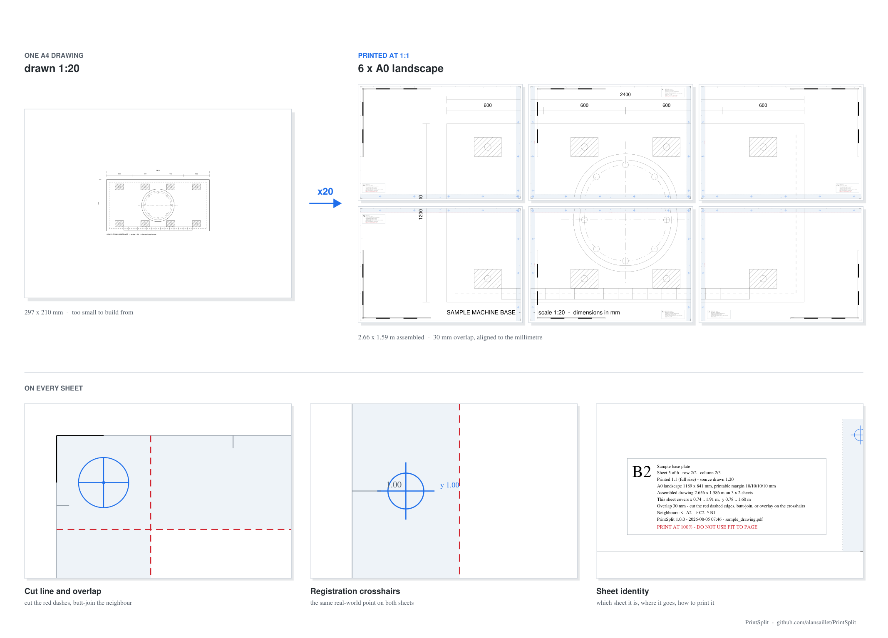

# PrintSplit

**Tile a scaled drawing across large sheets, precisely.**



A drawing at 1:50 that needs to be on the floor at 1:1, four metres wide?
PrintSplit magnifies it exactly, splits it across overlapping sheets, and prints
the cut lines, crosshairs and calibration ruler you need to put it back together
to the millimetre.

## Try it

```bash
pip install -r requirements.txt
python printsplit.py config/example.toml
```

That tiles the included sample onto six A0 sheets at 1:1. For your own drawing:

```bash
python printsplit.py --new path/to/drawing.pdf
```

which writes a config next to it, tiles it, and checks it. Edit the config and
re-run to change anything; add `--dry-run` to see the sheet count before
producing a file.

## What you get

* one PDF, one page per sheet, all the same size, ready for the plotter
* an assembly map showing which sheet goes where
* a report with every number behind the job

Every sheet carries cut lines, registration crosshairs sitting on identical
real-world coordinates, a 100 mm coordinate grid, and a 500 mm ruler that
catches a printer which rescaled the job.

## Documentation

| | |
|---|---|
| [Usage](docs/usage.md) | the CLI, batch runs, and where your jobs live |
| [Configuration](docs/configuration.md) | every setting, starting with the few you actually touch |
| [Markings and assembly](docs/markings.md) | what is on a sheet, and how to join them |
| [Line widths](docs/line-widths.md) | why a magnified drawing needs them re-weighted |
| [Checks](docs/checks.md) | what every run verifies for you |
| [Python API](docs/api.md) | driving PrintSplit from your own program |
| [Accuracy](docs/accuracy.md) | why the result comes out exact |
| [Alternatives](docs/alternatives.md) | pdfposter, PosteRazor, Acrobat, and where they stop |

Prefer buttons? There is a desktop front end:
**[PrintSplit GUI](https://github.com/alansaillet/PrintSplit-GUI)**.

## Requirements

Python 3.11+ and [PyMuPDF](https://pymupdf.readthedocs.io). That is the only
dependency.

## Tests

```bash
python -m pytest
```

Each test file also runs standalone (`python tests/test_layout.py`) if you would
rather not install pytest.

## License

MIT — see [LICENSE](LICENSE).
